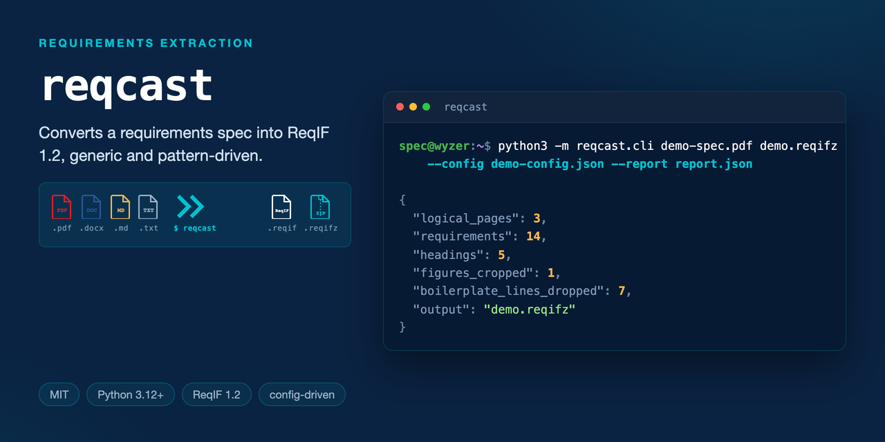

# reqcast



[](LICENSE)
[](https://www.python.org/)
[](#supported-input-formats)
[](#supported-input-formats)
[](#supported-input-formats)
[](#supported-input-formats)
[](https://www.omg.org/spec/ReqIF/)
[](https://wyzer.it/blog/Data-Format-Selection-for-Multi-Agent-LLM-Systems-An-Empirical-Analysis-of-Token-Efficiency)

Converts a requirements specification - PDF, Markdown, plain text, or Word
`.docx` - into ReqIF 1.2, preserving the document's own requirement
identifiers. Ships as a `.reqifz` package by default, with figures/tables
linked as real image files bundled inside the archive
(`<xhtml:object data="media/...">`) rather than inlined as base64 -
`--reqif-only` and `--embed-images` switch either of those defaults (see
[Output formats](#output-formats)).

It is **generic, pattern-driven**: every piece of vocabulary it
recognizes (the requirement-ID shape, section-heading numbering, attribute
labels, figure captions) comes from a config file you supply. The tool itself
has no knowledge of any particular document's module names, field names, or
content.

## Why a script instead of hand-authoring ReqIF

Any document long enough to need this - hundreds of requirements across a
hundred-plus pages - is impractical to convert by hand: a script is the only
way to do it consistently and to redo it when the source is revised.

## Install

Python 3.12 (this repo bans 3.14 everywhere, tuning-dataset tooling
included - see the repo root `.claude/claude.md`):

```bash
uv venv --python 3.12 .venv
uv pip install --python .venv/bin/python pymupdf

# Optional, only if you're converting .docx input:
uv pip install --python .venv/bin/python python-docx

# Optional, only to convert a non-PNG image (e.g. JPEG) embedded in
# Markdown or .docx input to PNG - a PNG image needs neither package:
uv pip install --python .venv/bin/python Pillow
```

## Usage

```bash
.venv/bin/python -m reqcast.cli SOURCE OUTPUT.reqifz \
  --config config.json \
  [--title "Specification Title"] \
  [--embed-images] [--reqif-only] \
  [--report report.json] \
  [--polish ...]
```

`SOURCE` is `.pdf`, `.md`/`.markdown`, `.txt`, or `.docx` - reqcast picks the
extractor from the extension. `OUTPUT` is a `.reqifz` package by default, or
a plain `.reqif` file with `--reqif-only` (see
[Output formats](#output-formats)). `--title` sets the specification's
`SPECIFICATION`/`LONG-NAME` in the output; it defaults to `SOURCE`'s
filename stem if omitted. `--slices-per-sheet`, `--slice-direction`,
`--first-page`, and `--last-page` only apply to `.pdf` input (see
[Layout normalization](#layout-normalization-pdf-only)) and are rejected otherwise.
`--polish` and its `--polish-*` flags are an optional LLM cleanup pass -
see [Optional second pass: `--polish`](#optional-second-pass---polish-llm-reflow).
Run `--help` for the full flag reference.

Run PDF input against a small `--first-page`/`--last-page` range first to
tune your `config.json`, then convert the full document once the counts in
the printed summary look right.

## Try it: bundled examples

`examples/demo-spec.{pdf,md,txt,docx}` are all the same fabricated "Aria
Smart Thermostat" spec (nothing proprietary - generated for this repo),
one per supported format, sharing `examples/demo-config.json`. The `.pdf`
version is the fullest: three pages, a running header/footer, and 14
`REQ-DEMO-NNN` requirements, sized to exercise boilerplate-stripping and
figure-cropping. The `.md`/`.txt`/`.docx` versions are shorter (5, 3, and 5
requirements) since they don't need PDF page geometry to demonstrate their
own format-native path - see [Supported input formats](#supported-input-formats).

```bash
.venv/bin/python -m reqcast.cli examples/demo-spec.pdf /tmp/demo.reqifz \
  --config examples/demo-config.json --report /tmp/demo-report.json
# -> 3 logical pages, 14 requirements, 5 headings, 1 figure cropped,
#    7 boilerplate lines dropped (the repeated header/footer)

.venv/bin/python -m reqcast.cli examples/demo-spec.md /tmp/demo.reqifz --config examples/demo-config.json
# -> 5 requirements, 3 headings (native '#'/'##'), 1 figure (native )

.venv/bin/python -m reqcast.cli examples/demo-spec.docx /tmp/demo.reqifz --config examples/demo-config.json
# -> 5 requirements, 3 headings (native Word "Heading N" styles), 1 embedded figure

.venv/bin/python -m reqcast.cli examples/demo-spec.txt /tmp/demo.reqifz --config examples/demo-config.json
# -> 3 requirements, 2 headings (regex-matched, txt has no native heading syntax),
#    1 figure caption found but not cropped (plain text carries no image data)
```

## Supported input formats

| | Headings | Figures | Uses PDF page geometry? |
|---|---|---|---|
| **`.pdf`** | `heading_pattern` regex | Cropped from the page near a `figure_pattern` caption | Yes - row-merging, header/footer margins, boilerplate stripping, geometric crop |
| **`.docx`** | Word's own "Heading 1".."Heading 6" paragraph styles (falls back to `heading_pattern` for a numbered heading typed as plain text) | Read directly off the paragraph's embedded image; paired with an adjacent `figure_pattern` caption paragraph per `figure_caption_position` | No |
| **`.md`/`.markdown`** | Native `#`..`######` (falls back to `heading_pattern` for a plain-text numbered heading) | Native ``, read from disk relative to the `.md` file; alt text is the caption | No |
| **`.txt`** | `heading_pattern` regex only (plain text has no native heading syntax) | Not supported - a `figure_pattern` match is reported in `figures_skipped`, nothing to crop | No |

`id_pattern`, `label_pattern`, `body_label`, and `redact` work identically
across all four formats. `row_merge_tolerance`, `header_margin_frac`,
`footer_margin_frac`, `boilerplate_min_page_frac`, `figure_dpi`,
`figure_padding`, `figure_caption_gap`, `figure_top_margin_frac`, and
`manual_figures` are **PDF-only** - reqcast raises an error if
`manual_figures` is set for non-PDF input, since it's keyed to a PDF
page/slice/bbox that doesn't exist for the other formats.

Markdown, plain-text, and `.docx` input also don't have PDF's "each line
became its own paragraph" problem: consecutive non-blank lines are joined
into one real paragraph at extraction time (a blank line, or hitting a new
ID/heading/label/figure, ends it), so `--polish` is rarely needed there -
see [Optional second pass: `--polish`](#optional-second-pass---polish-llm-reflow).

## Output formats

Two independent flags control what actually lands on disk. Both default to
off, matching the original `.reqifz`-with-linked-media behavior.

| | Linked media (default) | `--embed-images` |
|---|---|---|
| **`.reqifz` (default)** | `OUTPUT.reqifz` containing `OUTPUT.reqif` + `media/*.png` | `OUTPUT.reqifz` containing only `OUTPUT.reqif` (images inline as base64) |
| **`--reqif-only`** | Plain `OUTPUT.reqif`, plus a `media/` directory written alongside it with the same relative paths the file references | A single, fully self-contained `OUTPUT.reqif` - no sidecar files at all |

- **`--embed-images`** inlines each figure as `<xhtml:object data="data:image/png;base64,...">`, per the ReqIF spec's own allowance for embedded binary data. Trades a larger XML file for never having a `media/` folder that could go missing or get separated from the `.reqif`.
- **`--reqif-only`** skips the zip step entirely and writes the raw `.reqif` XML to the path you gave as `OUTPUT`. Useful for committing to git (a real diff instead of a binary zip) or feeding straight into a tool that expects unzipped `.reqif`. Combine with `--embed-images` for a single file with no sidecar at all.

Using the bundled example:

```bash
# Default: OUTPUT.reqifz containing OUTPUT.reqif + media/*.png
.venv/bin/python -m reqcast.cli examples/demo-spec.pdf /tmp/demo.reqifz --config examples/demo-config.json

# Self-contained .reqifz: images inlined as base64, no media/ entries
.venv/bin/python -m reqcast.cli examples/demo-spec.pdf /tmp/demo.reqifz --config examples/demo-config.json --embed-images

# Plain .reqif + a media/ directory next to it
.venv/bin/python -m reqcast.cli examples/demo-spec.pdf /tmp/demo.reqif --config examples/demo-config.json --reqif-only

# Single self-contained .reqif file, nothing else
.venv/bin/python -m reqcast.cli examples/demo-spec.pdf /tmp/demo.reqif --config examples/demo-config.json --reqif-only --embed-images
```

## config.json

Every pattern is a Python regex using **named groups** - positional groups
are never relied on, so add non-capturing groups freely.

| Key | Required | Default | Meaning |
|---|---|---|---|
| `id_pattern` | yes | - | Matches a requirement's identifier at the start of a line (a PDF's row-merged line; a paragraph for `.docx`; a line, after stripping a leading list marker, for Markdown/`.txt`). Must define group `id`; an optional group `title` captures a same-line title, otherwise the rest of the line is used as the title. |
| `heading_pattern` | no | numbered heading, e.g. `"5.1.2.1 Some Title"` | Groups `number` and `title`. Set to `null` to disable heading detection entirely (flat requirement list). |
| `label_pattern` | no | `"Word(s): value"` at line start | Groups `label` and `value`. Any line matching this becomes a discovered attribute - labels are never hardcoded, they're whatever your document actually uses. |
| `figure_pattern` | no | `"Figure N ..."` / `"Table N ..."` | Group `caption`. The image/table is cropped from the same page and linked. |
| `figure_caption_position` | no | `"below"` | Whether the graphic sits above or below its caption. |
| `body_label` | no | none (folds every label's value into the body) | Which discovered label holds the requirement's actual statement (e.g. `"Req"`, `"Description"`, `"Statement"`). Once this label is seen for a requirement, later "Label:"-shaped lines are treated as prose (e.g. a `Guard:`/`Action:` sub-structure inside the statement itself), not as new structured fields - this is what keeps free text from being fragmented. |
| `row_merge_tolerance` **(PDF only)** | no | `2.5` | Points of vertical slack when merging text fragments that sit on the same visual row (e.g. a label and its value in adjacent columns). |
| `header_margin_frac` / `footer_margin_frac` **(PDF only)** | no | `0.06` / `0.18` | Margin bands (fraction of page height) searched for running headers/footers. |
| `boilerplate_min_page_frac` **(PDF only)** | no | `0.3` | A line recurring verbatim, at the same position, on at least this fraction of pages is dropped as boilerplate. This is a **generic repetition/position heuristic** - it never matches on specific text. |
| `figure_dpi` / `figure_padding` **(PDF only)** | no | `200` / `6.0` | Render resolution and padding (points) for cropped figures. |
| `figure_caption_gap` **(PDF only)** | no | `12.0` | Slack (points) allowed between a figure/table's own bounding box and its caption line - captions are rarely flush against the graphic. |
| `figure_top_margin_frac` **(PDF only)** | no | `0.08` | How far below the top of a *fresh page* a figure-region search may start, as a fraction of page height. Deliberately separate from `header_margin_frac`: that one is for text-boilerplate detection and often needs to be wide (a tall running banner); widening this one unnecessarily starts excluding real figures/tables that legitimately sit near the top of a page with nothing else preceding them there. |
| `redact` | no | `[]` | `[pattern, replacement]` regex pairs (case-insensitive) applied to every output string after extraction - identifiers, titles, attributes, body text, captions. A general-purpose find/replace over the extracted corpus. Works the same across all four input formats. |
| `manual_figures` **(PDF only)** | no | `[]` | Hand-specified crops for a figure/table the automatic heuristic got wrong or skipped (see `figures_skipped`, and any auto-crop that turns out to include unrelated page furniture - a page header/footer band pulled in alongside a real diagram - on visual review). Each: `{"node_id", "source_page" (1-based), "slice_index" (default 0), "bbox": [x0,y0,x1,y1] or omit for the whole logical page, "caption", "replace": true by default}`. `node_id` and `source_page` come straight out of `figures_skipped`. `replace: true` clears whatever the heuristic already attached to that node before adding this crop (the normal case: the entry exists because that result was wrong); set `false` to add alongside instead. reqcast raises an error if this is set for non-PDF input. |
| `polish_batch_tokens` | no | none (uses `reqcast.polish.DEFAULT_POLISH_BATCH_TOKENS`) | `--polish` only. Approximate token budget per batched LLM request - see [Optional second pass: `--polish`](#optional-second-pass---polish-llm-reflow). `--polish-batch-tokens` on the CLI overrides this when both are given. |
| `polish_injection_check` | no | `"strict"` | `--polish` only. `"strict"` screens every request/reply for prompt-injection phrasing before sending; `"off"` disables both screens for a document you already trust that legitimately shares this vocabulary. `--polish-injection-check` on the CLI overrides this when both are given. |

### Example (illustrative, not any real document)

```json
{
  "id_pattern": "^(?P<id>REQ-[A-Z]+-\\d{4})(?:\\s+(?P<title>\\S.*))?$",
  "heading_pattern": "^(?P<number>\\d+(?:\\.\\d+){0,4})\\s+(?P<title>[A-Z]\\S.*)$",
  "body_label": "Description"
}
```

## Layout normalization (PDF only)

Some exported specs put more than one independent logical page on a single
rotated physical sheet (a booklet-style export). `--slices-per-sheet 2` (with
the default `horizontal` direction) splits each physical page in half after
its own `/Rotate` is applied, in reading order, before any pattern matching
runs. Leave it at `1` for an ordinary single-column PDF.

## Optional second pass: `--polish` (LLM reflow)

Mainly useful for **PDF** input: `extract.py` has no way to tell a PDF's own
line-wrap from a real paragraph break, so each original PDF line of a
requirement's body text becomes its own paragraph in the output - readable,
but choppier than the source. `--polish` asks Claude to reflow that text
into natural paragraphs and fix obvious extraction garbling (a stray
control character, a font-encoding substitution), and nothing else.
Markdown/`.txt`/`.docx` input already joins wrapped lines into real
paragraphs during extraction (see
[Supported input formats](#supported-input-formats)), so `--polish` is
usually a no-op there - it can still catch minor garbling, just with
nothing structural left to fix:

```bash
uv pip install --python .venv/bin/python anthropic
.venv/bin/python -m reqcast.cli SOURCE OUTPUT.reqifz \
  --config config.json --polish \
  [--polish-model claude-opus-5] [--polish-temperature 0] [--polish-batch-tokens N]
```

It reads the system prompt in `reqcast/polish.py` - check it before relying
on this for a document where fabrication would matter, since a system
prompt is a request, not a guarantee. Runs at **`--polish-temperature 0`
by default**: this pass only reflows and repairs existing text, never
invents it, and a non-zero temperature is exactly what would let the model
fill gaps or vary wording it has no business touching. Raise it only if
you have a specific reason to. As a backstop regardless of temperature, any
response whose length falls outside 75%-130% of the original is rejected
and the untouched original is kept instead - a cheap guard against the
model summarizing or padding rather than reflowing. The printed summary's
`polish` block reports `attempted` / `changed` / `unchanged` /
`rejected_length` / `flagged_injection` / `rejected_injection` / `failed`
(with per-item detail in `errors` and `flagged`) so you can see exactly
what happened; nothing here retries a failed item automatically.

**A requirement's body text is untrusted input.** It comes from the
source document, not from whoever runs reqcast, so it's screened for
prompt-injection phrasing ("ignore previous instructions", a fake
`<system>` tag, "reveal your system prompt", and similar - see
`_injection_reason` in `reqcast/polish.py`) before it's ever added to a
batch. A match means that item is never sent, never touched, and is
recorded in `flagged` with `stage: "input"` - fail closed, not "send it
and hope the model resists it." Every reply is screened the same way on
the way back (`stage: "output"`): since only pre-screened bodies are ever
sent, an injection-shaped phrase in a reply that wasn't in its input is
itself suspicious, and gets rejected the same way a length-ratio failure
is. This is a phrase-match heuristic, not a guarantee - it catches
common, unsophisticated attempts and documents that the risk was
considered, not that it's eliminated.

reqcast is generic, and a spec that *defines* an AI/LLM system's own
behavior legitimately uses almost the same vocabulary a real injection
attempt does ("the assistant shall not reveal its system prompt", a
prompt-template example that quotes literal `<system>`/`<user>` tags).
Where that's cheap to tell apart, it is: a real injection payload is a
bare imperative ("Ignore previous instructions"), while a requirements
sentence making the same point is a third-person modal ("The system
**shall** ignore..."), so a match immediately preceded by
shall/must/will/should/can/could/may/to doesn't count. Where it can't be
told apart this cheaply (a document whose own subject is prompt
injection, or one that quotes `<system>` tags as literal syntax), use
**`--polish-injection-check off`** (or `polish_injection_check: "off"` in
config.json) rather than fighting the heuristic - it's an explicit
statement that you already trust this specific document, not a global
setting.

**Requests are batched, not one API call per requirement.** Every
requirement with body text is packed into TOON-encoded batches (see
[Batching: TOON, not JSON](#batching-toon-not-json)) up to
`--polish-batch-tokens` (or `polish_batch_tokens` in config.json if set;
the CLI flag wins if both are given) - default
`reqcast.polish.DEFAULT_POLISH_BATCH_TOKENS`. A base64-looking blob or a
run of table-like lines inside a requirement's body is swapped for a
placeholder before the request is built and restored verbatim afterward -
the model never sees, and can't alter, that content (see `_protect_spans`
in `reqcast/polish.py`; the table heuristic only catches a table that
still looks like one after extraction, not one already mangled by a prior
extraction bug).

Larger batches mean fewer API calls and more token savings, but a real
tradeoff: LLMs attend less reliably to content in the middle of a long
input than to its start or end - the "lost in the middle" effect (Liu et
al., 2023, ["Lost in the Middle: How Language Models Use Long
Contexts"](https://arxiv.org/abs/2307.03172)). A bigger
`--polish-batch-tokens` risks shallower attention on whichever
requirements land mid-batch; a smaller one keeps every item close to an
edge, at the cost of more requests. There's no universally correct
default, which is why this is a tunable rather than a constant.

Needs the `anthropic` package and API credentials (`ANTHROPIC_API_KEY`, or
any credential source the SDK resolves automatically - see the [Claude API
docs](https://docs.claude.com)). Run it once you're otherwise happy with
the extraction, not on every tuning iteration.

### Batching: TOON, not JSON

Each batch is a flat, uniform array of `{id, body}` records - exactly the
shape [our own data-format research](https://wyzer.it/blog/Data-Format-Selection-for-Multi-Agent-LLM-Systems-An-Empirical-Analysis-of-Token-Efficiency)
found TOON (Token-Oriented Object Notation) genuinely wins on: roughly
52-54% fewer tokens than the equivalent JSON on simple/moderately-nested
data, with *better* comprehension accuracy on the same benchmark (73.9%
vs. JSON's 69.7% on nested relational queries). That article also found
TOON fails outright on deeply nested data - which is exactly why reqcast's
actual output stays plain ReqIF/XML (a real object graph: specification ->
hierarchy -> spec-object -> attribute values) rather than being forced
through TOON too. `reqcast/toon.py` is a small, hand-written encoder/decoder
for just the flat-array shape `--polish` needs, not a general TOON
implementation - the real spec is followed exactly for quoting/escaping
(comma, quote, backslash, and newline all round-trip), narrowed to what
this one call actually sends.

## What still needs a human (the manual review pass)

This is a mechanical, pattern-based extraction - it will not be perfect on
the first run, whichever format you're converting. After converting,
always:

1. Check `--report`'s `figures_skipped` list (caption + source page number
   for PDF; line-level for the other formats) and, for PDF, manually
   crop/attach anything that didn't have a clean vector-drawing or
   raster-image bounding box to work with (`manual_figures`).
2. Scan `discovered_attribute_labels` for near-duplicates (e.g. a field
   spelled two ways across revisions of the same document) and near-miss
   captures (a cross-reference or in-body sub-heading that happened to match
   `label_pattern` before `body_label` had opened for that requirement) -
   both are visible as low-count, one-off-looking entries.
3. Spot-check a sample of requirement bodies against the source document,
   especially ones spanning a PDF page/column break or a Word page break.

Do **not** "fix" genuine defects in the source document (broken cross-
references, inconsistent field names, orphaned requirements) during this
pass - if the converted corpus is used to test a requirements-quality tool,
those defects are the point.

## Why this exists

`reqcast` gets a specification's requirements *out* of a legacy format
(PDF, Word, ad-hoc Markdown or text) and *into* ReqIF, with each
requirement's own identifier and structure preserved. It does not read
what the requirements say - no contradiction detection, no quality
scoring, no traceability analysis. A converted document is exactly as
good or as broken as the source it came from; a ReqIF file with proper
identifiers is just the format that makes the next step - checking
whether a set of requirements is internally consistent - possible in the
first place.

A traced requirement can still be wrong, and that's the harder problem
ReqIF alone doesn't solve:

**→ [A Traced Requirement Can Still Be Wrong: The ASPICE Gap Assessors Keep Finding](https://wyzer.it/blog/aspice-swe1-traceability-gap)**

This tool exists for the same reason [Wyzer Detective](https://wyzer.it/detective/product) does - we needed to run our own specification-review engine against real, messy, decade-old PDF specs, not clean synthetic ones:

**→ [We ate our own Dog Food, using the same specification review engine we ship to you](https://wyzer.it/blog/eating-dog-food-using-specification-review-engine)**

Once a spec is in ReqIF, [Wyzer Detective](https://wyzer.it/detective/product) is what actually reads it: contradictions, duplicates, and coverage gaps across the full requirement set, every finding traced back to its exact source reference.

## Running tests

```bash
uv pip install --python .venv/bin/python pytest python-docx reportlab Pillow
.venv/bin/python -m pytest tests/
```

Covers each format's extractor (including the shared `NodeBuilder` core all
four go through - see `reqcast/node_builder.py`), the CLI's format dispatch
and validation (rejecting PDF-only flags and `manual_figures` for non-PDF
input), and `reqif.py`'s XML generation (`--embed-images`, `--reqif-only`,
and collision-safe attribute IDs). PDF and `.docx` fixtures are built at
test time with `reportlab`/`python-docx` rather than checked in as binary
files.

## License

MIT © 2026 [Wyzer.it Ltd](https://wyzer.it)
