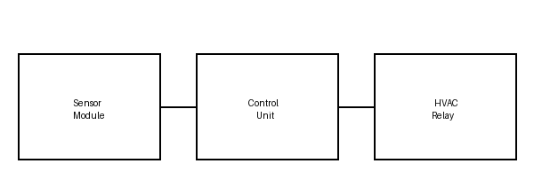

# Aria Smart Thermostat

Software Requirements Specification (fabricated example document)

## 3.1 Power Management

- REQ-DEMO-001 Low-power standby
Description: The thermostat shall enter standby mode after 120 seconds of no user
interaction and no active heating or cooling demand.

- REQ-DEMO-002 Battery backup runtime
Description: On mains power loss, the thermostat shall maintain display and sensor
operation for at least 4 hours from the internal battery.

- REQ-DEMO-003 Charge indicator
Description: The thermostat shall display a battery charge indicator whenever charge
is below 20%.

## 3.2 User Interface

- REQ-DEMO-004 Setpoint adjustment
Description: The user shall be able to adjust the target temperature in 0.5 degree
increments using the front-panel dial.

- REQ-DEMO-005 Display readability
Description: The display shall remain readable under direct sunlight of up to 10,000
lux.
